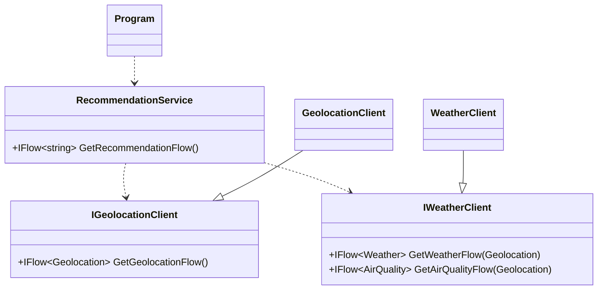
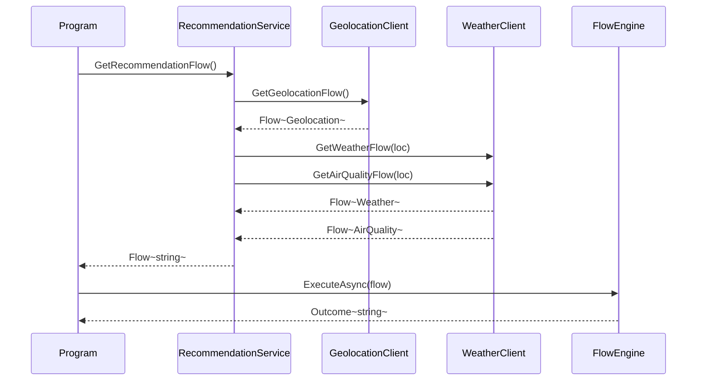

# 'Should I Go Outside?'

A simple console application that demonstrates how to use Flows to compose several real-world, failable API calls into a single, readable, resilient process.

It determines, using a silly algorithm 😅, if you should go outside by fetching your current location, weather, and air quality, and then applying a set of business rules to them.

# Quick Overview

It's got three main components, which are registered for DI in `Program.cs`.



---

The high-level sequence of operations looks like this:



# How to Run

From the root of the repository, run the following command:

```
dotnet run --project examples/ShouldIGoOutside
```

For example: 

```
Determining if you should go outside...
--> Determined location: San Jose
--> Air Quality API failed. Recovering with default AQI.
--> Fetched Weather: 25.1°C
--> Fetched Air Quality (AQI): 0

----------------------------------------
Recommendation: Yes, it's a great day to go outside!
----------------------------------------
```
